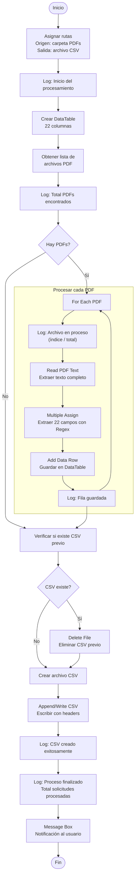

# Proyecto de Automatización Estructurada: Extracción e Ingesta de Datos
Vamos a diseñar este flujo de trabajo paso a paso. Construiremos un bot básico que extrae información de archivos PDF estructurados (ej. solicitudes de viáticos) y los transcribe automáticamente a una planilla, simulando el procesamiento ágil de una nómina estatal.

## Variables y Argumentos
| **Nombre**        | **Tipo de Variable**  | **Scope**       | **Descripción**                                            |
| ----------------- | --------------------- | --------------- | ---------------------------------------------------------- |
| dtSolicitudes     | System.Data.DataTable | Sequence (Main) | DataTable que almacena todas las solicitudes extraídas.    |
| archivosPDF       | System.String\[\]     | Sequence (Main) | Array con las rutas de todos los archivos PDF encontrados. |
| archivoActual     | System.String         | For Each (Body) | Ruta del PDF en la iteración actual.                       |
| numeroSolicitud   | System.String         | For Each (Body) | Campo extraído del PDF.                                    |
| fechaEmision      | System.String         | For Each (Body) | Campo extraído del PDF.                                    |
| organismo         | System.String         | For Each (Body) | Campo extraído del PDF.                                    |
| estado            | System.String         | For Each (Body) | Campo extraído del PDF.                                    |
| nombre            | System.String         | For Each (Body) | Campo extraído del PDF.                                    |
| cuilCuit          | System.String         | For Each (Body) | Campo extraído del PDF.                                    |
| legajo            | System.String         | For Each (Body) | Campo extraído del PDF.                                    |
| categoria         | System.String         | For Each (Body) | Campo extraído del PDF.                                    |
| reparticion       | System.String         | For Each (Body) | Campo extraído del PDF.                                    |
| motivo            | System.String         | For Each (Body) | Campo extraído del PDF.                                    |
| destino           | System.String         | For Each (Body) | Campo extraído del PDF.                                    |
| disposicion       | System.String         | For Each (Body) | Campo extraído del PDF.                                    |
| inicio            | System.String         | For Each (Body) | Campo extraído del PDF.                                    |
| finalizacion      | System.String         | For Each (Body) | Campo extraído del PDF.                                    |
| duracion          | System.String         | For Each (Body) | Campo extraído del PDF.                                    |
| tarifaDiaria      | System.String         | For Each (Body) | Campo extraído del PDF.                                    |
| dias              | System.String         | For Each (Body) | Campo extraído del PDF.                                    |
| montoViaticos     | System.String         | For Each (Body) | Campo extraído del PDF.                                    |
| gastosAdicionales | System.String         | For Each (Body) | Campo extraído del PDF.                                    |
| total             | System.String         | For Each (Body) | Campo extraído del PDF.                                    |
| autorizante       | System.String         | For Each (Body) | Campo extraído del PDF.                                    |
| tesoreria         | System.String         | For Each (Body) | Campo extraído del PDF.                                    |
| textoPDF          | System.String         | For Each (Body) | Texto completo extraído del PDF (para estrategia nativa).  |
| rutaOrigen        | System.String         | Sequence (Main) | Constante: "..\\formularios_solicitudes_viaticos"          |
| rutaCSV           | System.String         | Sequence (Main) | Constante: "..\\Reporte_Solicitudes_Viaticos.csv"          |

## Secuencia de Actividades en UiPath

**Resumen del flujo:**

| Paso | Actividad | Descripción |
|------|-----------|-------------|
| 1 | Asignar rutas | Define carpeta de PDFs y ruta del CSV de salida |
| 2 | Crear DataTable | Estructura con 22 columnas (Número Solicitud, Fecha, Organismo, Estado, Nombre, CUIL/CUIT, Legajo, Categoría, Repartición, Motivo, Destino, Disposición, Inicio, Finalización, Duración, Tarifa diaria, Días, Monto viáticos, Gastos adicionales, Total, Autorizante, Tesorería) |
| 3 | Obtener PDFs | `Directory.GetFiles` filtrando `*.pdf` |
| 4 | Loop For Each | Por cada PDF: lee texto, extrae campos con Regex, agrega fila |
| 5 | Gestionar CSV | Si existe CSV previo, lo elimina; crea nuevo y escribe datos |
| 6 | Notificación | Log final y Message Box al usuario |

## Configuración de Propiedades
### **Actividad 1: Log Message (Inicio)**
* **Message**: "Inicio del proceso de extracción de solicitudes de viáticos. Buscando archivos PDF en: " + rutaOrigen
* **Level**: Info

### **Actividad 2: Build Data Table**

* **DataTable**: dtSolicitudes (crear nueva variable)
* **Columns** (agregar 22 columnas de tipo String):
1. Número de Solicitud
2. Fecha de Emisión
3. Organismo
4. Estado
5. Nombre
6. CUIL/CUIT
7. Legajo
8. Categoría
9. Repartición
10. Motivo
11. Destino
12. Disposición
13. Inicio
14. Finalización
15. Duración
16. Tarifa diaria
17. Días
18. Monto viáticos
19. Gastos adicionales
20. Total
21. Autorizante
22. Tesorería

**Actividad 3: Assign (Obtener archivos)**
* **To**: archivosPDF
* **Value**: Directory.GetFiles(rutaOrigen, "\*.pdf")
**Actividad 4: For Each File in Folder**
* **Folder**: rutaOrigen
* **Filter**: "\*.pdf"
* **Body**: Sequence
* **CurrentFile**: archivoActual (tipo FileInfo o String según la actividad que uses; si usas For Each genérico con archivosPDF, usa archivoActual como String)

    **Nota**: En UiPath Studio 2026, puedes usar For Each File in Folder (moderno) o un For Each estándar iterando archivosPDF.

#### **Dentro del For Each:**
**\`Log Message\` (Abriendo archivo)**
* **Message**: "Abriendo archivo PDF: " + archivoActual.Name (o archivoActual si es String)
* **Level**: Info
**\`Read PDF Text\`**
* **FileName**: archivoActual.FullName (o archivoActual)
* **Output**: textoPDF
* **Range**: All

**Extracción de campos (22 actividades \`Assign\`)**
Usa System.Text.RegularExpressions.Regex.Match() para cada campo. Ejemplo para el primer campo:
* **To**: numeroSolicitud
* **Value**: System.Text.RegularExpressions.Regex.Match(textoPDF, "(?i)Número de Solicitud\[:\\s\]+(.+)").Groups(1).Value.Trim()
Repite este patrón para los 22 campos adaptando el patrón Regex según la etiqueta exacta que aparece en tu PDF. Ejemplo de patrones:

| **Campo**           | **Patrón Regex sugerido**                   |
| ------------------- | ------------------------------------------- |
| Número de Solicitud | (?i)Número de Solicitud\[:\\s\]+(.+)        |
| Fecha de Emisión    | (?i)Fecha de Emisión\[:\\s\]+(\[\\d/\\-\]+) |
| Organismo           | (?i)Organismo\[:\\s\]+(.+)                  |
| Estado              | (?i)Estado\[:\\s\]+(.+)                     |
| Nombre              | (?i)Nombre\[:\\s\]+(.+)                     |
| CUIL/CUIT           | (?i)CUIL/CUIT\[:\\s\]+(\[\\d\\-\]+)         |
| Legajo              | (?i)Legajo\[:\\s\]+(.+)                     |
| Categoría           | (?i)Categoría\[:\\s\]+(.+)                  |
| Repartición         | (?i)Repartición\[:\\s\]+(.+)                |
| Motivo              | (?i)Motivo\[:\\s\]+(.+)                     |
| Destino             | (?i)Destino\[:\\s\]+(.+)                    |
| Disposición         | (?i)Disposición\[:\\s\]+(.+)                |
| Inicio              | (?i)Inicio\[:\\s\]+(\[\\d/\\-\]+)           |
| Finalización        | (?i)Finalización\[:\\s\]+(\[\\d/\\-\]+)     |
| Duración            | (?i)Duración\[:\\s\]+(.+)                   |
| Tarifa diaria       | (?i)Tarifa diaria\[:\\s\]+(.+)              |
| Días                | (?i)Días\[:\\s\]+(.+)                       |
| Monto viáticos      | (?i)Monto viáticos\[:\\s\]+(.+)             |
| Gastos adicionales  | (?i)Gastos adicionales\[:\\s\]+(.+)         |
| Total               | (?i)Total\[:\\s\]+(.+)                      |
| Autorizante         | (?i)Autorizante\[:\\s\]+(.+)                |
| Tesorería           | (?i)Tesorería\[:\\s\]+(.+)                  |

**\`Add Data Row\`**

* **DataTable**: dtSolicitudes

* **ArrayRow**: {numeroSolicitud, fechaEmision, organismo, estado, nombre, cuilCuit, legajo, categoria, reparticion, motivo, destino, disposicion, inicio, finalizacion, duracion, tarifaDiaria, dias, montoViaticos, gastosAdicionales, total, autorizante, tesoreria}

**\`Log Message\` (Fila guardada)**

* **Message**: "Fila agregada correctamente para la solicitud: " + numeroSolicitud

* **Level**: Info

### **Actividad 5: If (Verificar existencia de CSV)**

* **Condition**: File.Exists(rutaCSV)

**\`Then\` (CSV no existe → crear con headers)**

* **\`Write CSV\`**

    * **FilePath**: rutaCSV

    * **DataTable**: dtSolicitudes

    * **AddHeaders**: True

    * **Delimiter**: Comma (o Semicolon si usas Excel en español)

**\`Else\` (CSV existe → anexar sin headers)**

* **\`Append CSV\`**

    * **FilePath**: rutaCSV

    * **DataTable**: dtSolicitudes

    * **AddHeaders**: False

    * **Delimiter**: Comma (o Semicolon)

### **Actividad 6: Log Message (Finalización)**

* **Message**: "Proceso finalizado exitosamente. Total de archivos procesados: " + archivosPDF.Count().ToString() + ". CSV generado en: " + rutaCSV

* **Level**: Info

### **Actividad 7: Message Box**

* **Text**: "El proceso ha concluido exitosamente." + Environment.NewLine + "Total de solicitudes procesadas: " + dtSolicitudes.Rows.Count.ToString() + Environment.NewLine + "Reporte guardado en: " + rutaCSV

* **Buttons**: Ok

* **Caption**: "Proceso Completado"

## **Recomendación para PDF: Estrategia según tipo de documento**

### A) PDF Nativo (texto seleccionable)

**Actividad recomendada:** Read PDF Text (del paquete **UiPath.PDF.Activities**).

- Instala el paquete UiPath.PDF.Activities desde Manage Packages.
- Usa Read PDF Text para volcar todo el contenido en una variable String.
- Aplica **Regex** (System.Text.RegularExpressions.Regex) para capturar cada campo por su etiqueta/label.
- Es la forma más rápida, confiable y mantenible.

### B) PDF Escaneado / Imagen (OCR necesario)

**Actividad recomendada:** Read PDF With OCR (del paquete **UiPath.PDF.Activities**) + motor OCR.

- Instala UiPath.PDF.Activities y un motor OCR como UiPath.OCR.Activities (Tesseract gratuito) o UiPath.IntelligentOCR.Activities (Document Understanding).
- Usa Read PDF With OCR en lugar de Read PDF Text.
- El texto extraído tendrá menos calidad; ajusta los Regex para ser más permisivos (ignorar espacios extra, caracteres similares).

**C) PDFs con estructura compleja o mixtos**

**Recomendación:** **Document Understanding Framework** (UiPath).

- Si los PDFs tienen tablas, campos posicionales fijos o variaciones de formato, usa el framework de Document Understanding.
- Crea un **Template** en **Document Manager** (AI Center) o usa **Regex Extractor** / **Form Extractor**.
- Es más robusto para producción pero requiere configuración adicional.